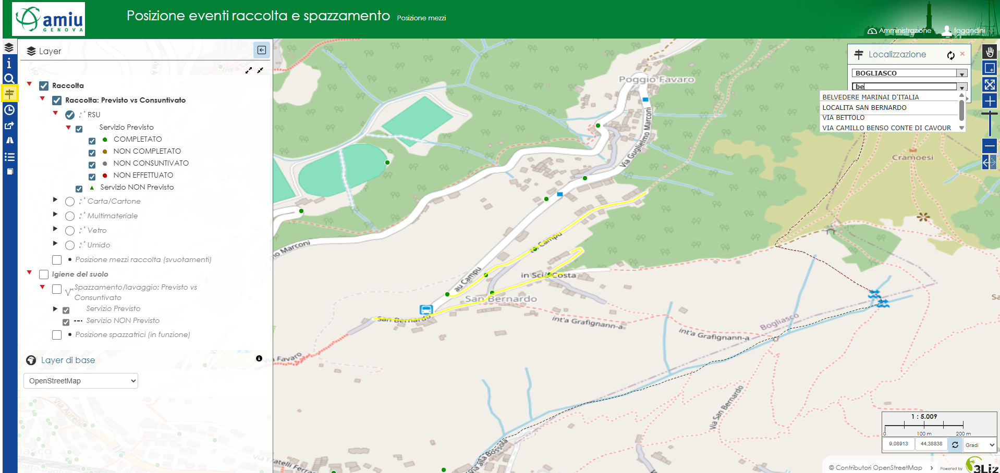
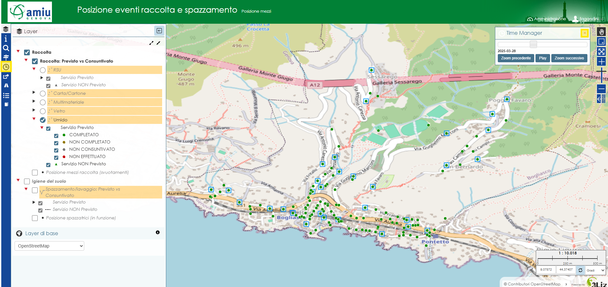

..
    this is a title

Istruzioni
==================

Questa mappa web è stata realizzata per la consultazione dei dati relativi a raccolta e spazzamento e in particolare:

* Previsto vs Consuntivato negli ultimi ultimi 60 giorni per raccolta e igiene del suolo
* Posizione mezzi raccolta dotati di strumentazione GPS a bordo in corrispondenza di un evento di svuotamento contenitore (presa di forza attivata o TAG rilevato). Dati disponibili per gli ultimi 60 giorni. 
* Posizione spazzatrici dotate di strumentazione GPS a bordo con spazzole in funzione. Dati disponibili per gli ultimi 60 giorni.

Sono attivi sulla mappa diversi tool per consentire una migliora navigazione e consultazione dei dati. In particolare, oltre agli strumenti standard (pan, zoom, ecc.), è possibile interrogare i dati semplicemente cliccando sull'elemento, consultare le immagini di Google Street View, visualizzare i dati in forma tabellare. 
Sono inoltre attivi alcuni tools che consentono:

* Ricerca per indirizzo (Comune e Via)
..
    * Ricerca per data (ultimi 60 giorni) della posizione dei mezzi di raccolta in corrispondenza di un evento di svuotamento contenitore e/o delle spazzatrici con spazzole in funzione
* Visualizzare giorno per giorno i servizi consuntivati rispetto ai programmati sia per raccolta che per l'igiene del suolo e la posizione dei mezzi di raccolta in corrispondenza di un evento di svuotamento contenitore e/o delle spazzatrici con spazzole in funzione

.. note:: Si ricorda che ogni utente potrà visualizzare e consultare i dati solo ed esclusivamente della propria area di competenza

..
    this is a section

RICERCA PER INDIRIZZO
------------------------------------------

1. Lo strumento è già attivo al caricamento della mappa e consente appunto di fare una ricerca per comune e via. Qualora fosse necessario riattivarlo è sufficiente cliccare sull'icona della toolbar (barra laterale a sinistra dello schermo) evidenziata in giallo nell'immagine sotto.

Selezionare il comune nel primo menù a tendina, il secondo verrà filtrato in funzione del Comune selezionato ed elencherà quindi le sole vie appartenenti a quel comune. 
Per selezionare la via è possibile digitare alcuni caratteri del nome o scorrere l'elenco. 

Una volta selezionato comune e relativa via, la mappa verrà zoomata e centrata sulla via cercata. Questa verrà inoltre evidenziata in giallo.

|
..
    RICERCA PER DATA POSIZIONE MEZZI
    ------------------------------------------

    2. E` necessario attivare lo strumento cliccando sull'icona della toolbar (barra laterale a sinistra dello schermo) evidenziata in giallo nell'immagine sotto. 
    Lo strumento consente di filtrare per data o range di date i dati degli ultimi 60 giorni relativi alla posizione dei mezzi di raccolta (svuotamenti) o delle spazzatrici con spazzole in funzione.

    Selezionare il dato da consultare ovvero posizione dei mezzi di raccolta (svuotamenti) o posizione delle spazzatrici in funzione. Selezionare successivamente la data per la quale consultare i dati. E` possibile selezionare un singolo giorno indicando la stessa data di inizio e fine oppure selezionare più giorni indicando una data di inizio e una di fine.
    La data può essere selezionata utilizzando la barra temporale oppure dal calendario che si apre cliccando sulla casella di testo riportante la data stessa.

    .. image:: img/filtro_tool.png
        :align: center

    |

    Una volta selezionato il livello da filtrare e la data, sulla mappa saranno visibili solo i dati che rispondono alle opzioni selezionate. E` naturalmente possibile visualizzare tutti i dati rimuovendo il filtro, è sufficiente cliccare sulla x evidenziata in giallo nell'immagine sotto.

    .. image:: img/filtro_result.png
        :align: center

    |

    .. warning:: Trattandosi di una considerevole mole di dati, lo strumento potrebbe impiegare qualche secondo per mostrare il risultato

    |

VISUALIZZAZIONE GIORNALIERA SERVIZI CONSUNTIVATI E POSIZIONE MEZZI 
------------------------------------------

3. Per prima cosa è necessario attivare il dato da consultare semplicemente spuntando la casella corrispondente nell'albero dei layer.

.. note:: E` possibile visualizzare contemporaneamente i dati della consuntivazione della raccolta e dello spazzamento ma per quanto riguarda la raccolta è possibile visualizzare solo una tipologia di rifiuto alla volta

Attivare lo strumento cliccando sull'icona della toolbar (barra laterale a sinistra dello schermo) evidenziata in giallo nell'immagine sotto e utilizzare i bottoni *Zoom precedente* e *Zoom successivo* o la barra temporale per visualizzare i dati in base al giorno. Utilizzando il tasto *Play*, la data cambierà automaticamente.
Sulla mappa saranno visibili solo i dati disponibili per la data selezionata. E` naturalmente possibile visualizzare tutti i dati rimuovendo il filtro, è sufficiente chiudere lo strumento cliccando sulla x o sull'icona della toolbar evidenziate in giallo nell'immagine sotto.

|

